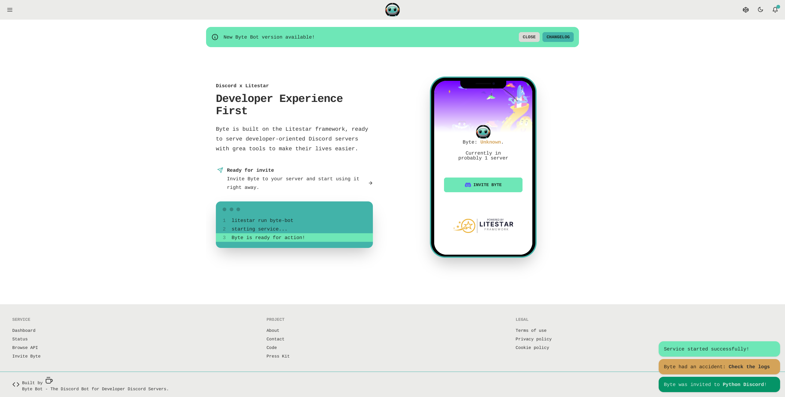

# Byte Bot

<!-- ALL-CONTRIBUTORS-BADGE:START - Do not remove or modify this section -->

<!-- ALL-CONTRIBUTORS-BADGE:END -->

> [!WARNING]\
> This repository holds very broken code.
> It is not recommended to use this code in any way.
> It is currently being used to learn the creation of a Discord bot, used by developers
> to enhance their community/guild experience with features like
>
> - GitHub integration
> - Upload Threads/Forum Posts to GitHub discussions
> - Sync commit contributions for a repo or organization to a Discord role (Commit Club type gamification)
> - Create GitHub issue from thread, forum post, or comment
>
> and whatever else is found to be useful.

All of this may go down in flames, though... so... yeah - good luck 😅

## Bot

The Discord bot is built on the [Discord.py v2][discordpy] library.

## Web

The web service is a [Litestar][litestar] application. It is utilizing [Jinja2][jinja] templating, [TailwindCSS][tailwind],
[DaisyUI][daisy], and [Feather icons][feather] for the front end, and the backend is using the Litestar-provided
utilities for routing, middleware, and more.

## Deployment

Byte is currently deployed to [Railway][railway] for both the bot and the web service in production
and testing.

## Development

You can use the provided [nixpack][nixpacks] config [file](./nixpacks.toml) config,
or set up your environment using PDM[pdm].

## Contributing

All contributions are welcome! Please see [CONTRIBUTING](./CONTRIBUTING.rst) for more information.

### UI Examples

[litestar]: https://litestar.dev
[discordpy]: https://discordpy.readthedocs.io/en/stable/
[jinja]: https://jinja.palletsprojects.com/en/3.0.x/
[tailwind]: https://tailwindcss.com/
[daisy]: https://daisyui.com/
[feather]: https://feathericons.com/
[railway]: https://railway.app?referralCode=BMcs0x
[nixpacks]: https://nixpacks.com/docs/getting-started
[pdm]: https://pdm.fming.dev/latest/

## Contributors ✨

Thanks goes to these wonderful people ([emoji key](https://allcontributors.org/docs/en/emoji-key)):

<!-- ALL-CONTRIBUTORS-LIST:START - Do not remove or modify this section -->
<!-- prettier-ignore-start -->
<!-- markdownlint-disable -->
<table>
  <tbody>
    <tr>
      <td align="center" valign="top" width="14.28%"><a href="https://github.com/Alc-Alc"> <b>Alc-Alc</b></a> <a href="https://github.com/JacobCoffee/byte/commits?author=Alc-Alc" title="Code">💻</a> <a href="#ideas-Alc-Alc" title="Ideas, Planning, & Feedback">🤔</a></td>
      <td align="center" valign="top" width="14.28%"><a href="https://github.com/apps/allcontributors"> <b>allcontributors[bot]</b></a> <a href="#projectManagement-allcontributors[bot]" title="Project Management">📆</a></td>
    </tr>
  </tbody>
</table>

<!-- markdownlint-restore -->
<!-- prettier-ignore-end -->

<!-- ALL-CONTRIBUTORS-LIST:END -->

This project follows the [all-contributors](https://github.com/all-contributors/all-contributors) specification. Contributions of any kind welcome!
